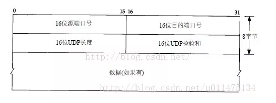
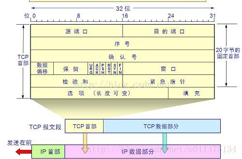
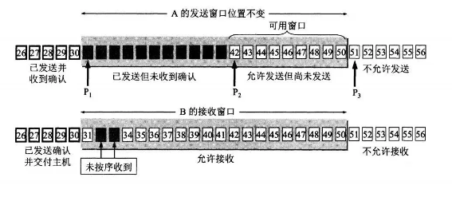
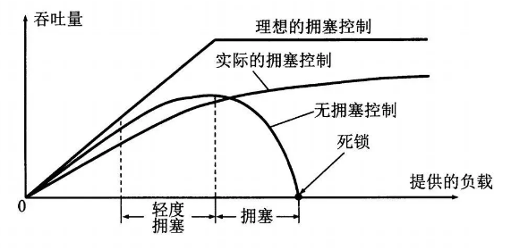
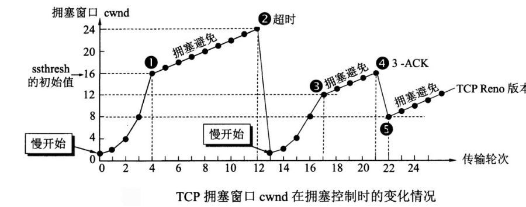

## TCP&UDP

### 前言

网络层只把分组发送到目的主机，真正通信的并不是主机而是主机中的进程。传输层提供了进程间的逻辑通信，传输层向高层用户屏蔽了下面网络层的核心细节，使应用程序看起来像是在两个传输层实体之间有一条端到端的逻辑通信信道。

### 1、UDP和TCP的特点与区别

UDP（用户数据报协议）：     
是无连接的，尽最大可能交付，没有拥塞控制，面向报文（对于应用程序传下来的报文不合并也不拆分，只是添加UDP首部），支持一对一、一对多、多对一和多对多的交互通信。

TCP（传输控制协议）：       
是面向连接的，提供可靠交付，有流量控制，拥塞控制，提供全双工通信，面向字节流（把应用层传下来的报文看成字节流，把字节流组织成大小不等的数据块），每一条TCP连接只能是点对点的（一对一）。

### 2、UDP、TCP首部格式

    
UDP首部字段只有8个字节，包括端口、目的端口、长度、检验和。12字节的伪首部是为了计算检验和临时添加的。

        
TCP首部较为复杂     
序号：用于对字节流进行编号，例如序号为301，表示第一个字节的编号为301，如果携带的数据长度为100字节，那么下一个报文段的序号应为401。      
确认号：期望收到的下一个报文段的序号。例如B正确收到A发送来的一个报文段，序号为501，携带的数据长度为200字节，因此B期望下一个报文段的序号为701，B发送给A的确认报文段中确认号为701。       
数据偏移：指的是数据部分距离报文段起始处的偏移量，实际上指的是首部的长度。
控制位：八位从左到右分别是CWR，ECE，URG，ACK，PSH，RST，SYN，FIN。      
窗口：窗口值作为接收方让发送方设置其发送窗口的依据。之所以有这个限制，是因为接收方的数据缓存空间是有限的。

### 3、什么是TCP三次握手和四次挥手

TCP是一种面向连接的单播协议，在发送数据前，通信双方必须在彼此间简历一条连接。所谓“连接”，其实是客户端和服务器的内存里保存着一份关于对方的信息，如IP地址、端口号等。     
TCP可以看成一种字节流，它会处理IP层或一下的层的丢包、重复以及错误问题。在连接的建立过程中，双方需要交换一些连接的参数。这些参数可以放在TCP头部。        
TCP提供了一种可靠、面向连接、字节流、传输层的服务，采用三次握手建立一个连接；采用四次挥手来关闭一个连接。       
一个TCP连接由一个4元组构成，分别是两个IP地址和两个端口号。一个TCP连接通常分为三个阶段：启动、数据传输、退出（关闭）。       
当TCP接收到另一端的数据时吗，它会发送一个确认，但这个确认不会立即发送，一般会延迟一会。     
ACK是累积的，一个确认字节号N的ACK表示所有知道N的字节（不包括N）已经成功被接收了。这样的好处是如果一个ACK丢失，很可能后续的ACK就足以确认前面的报文段了。     
一个完整的TCP连接是双向和对称的，数据可以在两个方向上平等地流动。给上层应用程序提供一种双工服务。一旦建立一个连接，这个连接的一个方向上的每个TCP报文段都包含了相反方向上的报文段的一个ACK。     
序列号的作用是使得一个 TCP 接收端可丢弃重复的报文段，记录以杂乱次序到达的报文段。因为 TCP 使用 IP 来传输报文段，而IP 不提供重复消除或者保证次序正确的功能。     
另一方面，TCP 是一个字节流协议，绝不会以杂乱的次序给上层程序发送数据。因此 TCP 接收端会被迫先保持大序列号的数据不交给应用程序，直到缺失的小序列号的报文段被填满。

### 4、TCP三次握手
- A 向 B 发送连接请求报文，SYN=1，ACK=0，选择一个初始的序号 x。
- B 收到连接请求报文，如果同意建立连接，则向 A 发送连接确认报文， SYN=1，ACK=1，确认号为 x+1，同时也选择一个初始的序号 y。
- A 收到 B 的连接确认报文后，还要向 B 发出确认，确认号为 y+1，序号为 x+1。

第一次握手：客户端向服务器传达，想要建立连接，如果服务器收到了第一次握手的信息，那么服务器可以得出结论，客户端的发送功能和自身服务器的接收功能正常，并且客户端有建立连接的意愿。        
第二次握手：服务器向客户端传达，收到服务连接建立请求，并且同意建立连接。如果客户端收到了服务器第二次握手的信息，那么客户端可以得出结论：我第一次握手的信息发送成功并且服务成功接收，因此我的发送功能和服务器的接收功能正常并且我收到了服务器的反馈，说明服务器的发送功能和我的接收功能正常，并且服务器同意建立连接。        
第三次握手：客户端向服务器传达，收到服务器关于连接建立请求的确认。如果服务器成功收到了客户端发送的关于第二次握手的反馈，那么服务器可以得出结论：服务器的发送功能和客户端的接收功能正常，可以建立连接。至此双方确认彼此收发功能正常，并且有建立连接的意愿，连接建立。

三次握手是连接建立之前对服务器和客户端能否正常进行全双工通信的一次检查，双方都需要确认：自身发送和接收功能正常、对方接收和发送功能正常，这样才可以建立连接。

### 5、TCP的四次挥手
- 客户端发送一个 FIN 段，并包含一个希望接收者看到的自己当前的序列号 K. 同时还包含一个 ACK 表示确认对方最近一次发过来的数据。
- 服务端将 K 值加 1 作为 ACK 序号值，表明收到了上一个包。这时上层的应用程序会被告知另一端发起了关闭操作，通常这将引起应用程序发起自己的关闭操作。
- 服务端发起自己的 FIN 段，ACK=K+1, Seq=L。
- 客户端确认。进入 TIME-WAIT 状态，等待 2 MSL（最大报文存活时间）后释放连接。ACK=L+1。

1、TCP连接是双向传输的对等的模式，就是说双方都可以同时向对方发送或接收数据。当有一方要关闭连接时，会发送指令告知对方，我要关闭连接了。

2、这时对方会回一个ACK，此时一个方向的连接关闭。但是另一个方向仍然可以继续传输数据，也就是说，服务端收到客户端的 FIN 标志，知道客户端想要断开这次连接了，但是，我服务端，我还想发数据呢？我等到发送完了所有的数据后，会发送一个 FIN 段来关闭此方向上的连接。接收方发送 ACK确认关闭连接。

注意，接收到FIN报文的一方只能回复一个ACK, 它是无法马上返回对方一个FIN报文段的，因为结束数据传输的“指令”是上层应用层给出的，我只是一个“搬运工”，我无法了解“上层的意志”。

3、客户端发送了 FIN 连接释放报文之后，服务器收到了这个报文，就进入了 CLOSE-WAIT 状态。这个状态是为了让服务器端发送还未传送完毕的数据，传送完毕之后，服务器会发送 FIN 连接释放报文。

4、因为服务端在 LISTEN 状态下，收到建立连接请求的 SYN 报文后，把 ACK 和 SYN 放在一个报文里发送给客户端。而关闭连接时，当收到对方的 FIN 报文时，仅仅表示对方不再发送数据了但是还能接收数据，己方是否现在关闭发送数据通道，需要上层应用来决定，因此，己方 ACK 和 FIN 一般都会分开发。

### 6、TCP短连接和长链接的区别
**短连接**：Client 向 Server 发送消息，Server 回应 Client，然后一次读写就完成了，这时候双方任何一个都可以发起 close 操作，不过一般都是 Client 先发起 close 操作。短连接一般只会在 Client/Server 间传递一次读写操作。

短连接的优点：管理起来比较简单，建立存在的连接都是有用的连接，不需要额外的控制手段。

**长连接**：Client 与 Server 完成一次读写之后，它们之间的连接并不会主动关闭，后续的读写操作会继续使用这个连接。

在长连接的应用场景下，Client 端一般不会主动关闭它们之间的连接，Client 与 Server 之间的连接如果一直不关闭的话，随着客户端连接越来越多，Server 压力也越来越大，这时候 Server 端需要采取一些策略，如关闭一些长时间没有读写事件发生的连接，这样可以避免一些恶意连接导致 Server 端服务受损；如果条件再允许可以以客户端为颗粒度，限制每个客户端的最大长连接数，从而避免某个客户端连累后端的服务。

长连接和短连接的产生在于 Client 和 Server 采取的关闭策略，具体的应用场景采用具体的策略。

### 7、TCP粘包、拆包及解决办法
**为什么常说 TCP 有粘包和拆包的问题而不说 UDP ？**

由前两节可知，UDP 是基于报文发送的，UDP首部采用了 16bit 来指示 UDP 数据报文的长度，因此在应用层能很好的将不同的数据报文区分开，从而避免粘包和拆包的问题。

而 TCP 是基于字节流的，虽然应用层和 TCP 传输层之间的数据交互是大小不等的数据块，但是 TCP 并没有把这些数据块区分边界，仅仅是一连串没有结构的字节流；另外从 TCP 的帧结构也可以看出，在 TCP 的首部没有表示数据长度的字段，基于上面两点，在使用 TCP 传输数据时，才有粘包或者拆包现象发生的可能。

**什么是粘包、拆包？**

假设 Client 向 Server 连续发送了两个数据包，用 packet1 和 packet2 来表示，那么服务端收到的数据可以分为三种情况，现列举如下：

第一种情况，接收端正常收到两个数据包，即没有发生拆包和粘包的现象。

第二种情况，接收端只收到一个数据包，但是这一个数据包中包含了发送端发送的两个数据包的信息，这种现象即为粘包。这种情况由于接收端不知道这两个数据包的界限，所以对于接收端来说很难处理。

第三种情况，这种情况有两种表现形式，如下图。接收端收到了两个数据包，但是这两个数据包要么是不完整的，要么就是多出来一块，这种情况即发生了拆包和粘包。这两种情况如果不加特殊处理，对于接收端同样是不好处理的。

**为什么会发生 TCP 粘包、拆包？**

- 要发送的数据大于 TCP 发送缓冲区剩余空间大小，将会发生拆包。
- 待发送数据大于 MSS（最大报文长度），TCP 在传输前将进行拆包。
- 要发送的数据小于 TCP 发送缓冲区的大小，TCP 将多次写入缓冲区的数据一次发送出去，将会发生粘包。
- 接收数据端的应用层没有及时读取接收缓冲区中的数据，将发生粘包。

**粘包、拆包解决办法**

由于 TCP 本身是面向字节流的，无法理解上层的业务数据，所以在底层是无法保证数据包不被拆分和重组的，这个问题只能通过上层的应用协议栈设计来解决，根据业界的主流协议的解决方案，归纳如下：

- 消息定长：发送端将每个数据包封装为固定长度（不够的可以通过补 0 填充），这样接收端每次接收缓冲区中读取固定长度的数据就自然而然的把每个数据包拆分开来。
- 设置消息边界：服务端从网络流中按消息边界分离出消息内容。在包尾增加回车换行符进行分割，例如 FTP 协议。
- 将消息分为消息头和消息体：消息头中包含表示消息总长度（或者消息体长度）的字段。
- 更复杂的应用层协议比如 Netty 中实现的一些协议都对粘包、拆包做了很好的处理。

### 8、TCP滑动窗口
窗口是缓存的一部分，用来暂时存放字节流。发送方和接收方各有一个窗口，接收方通过 TCP 报文段中的窗口字段告诉发送方自己的窗口大小，发送方根据这个值和其它信息设置自己的窗口大小。

发送窗口内的字节都允许被发送，接收窗口内的字节都允许被接收。如果发送窗口左部的字节已经发送并且收到了确认，那么就将发送窗口向右滑动一定距离，直到左部第一个字节不是已发送并且已确认的状态；接收窗口的滑动类似，接收窗口左部字节已经发送确认并交付主机，就向右滑动接收窗口。

接收窗口只会对窗口内最后一个按序到达的字节进行确认，例如接收窗口已经收到的字节为 {31, 34, 35}，其中 {31} 按序到达，而 {34, 35} 就不是，因此只对字节 31 进行确认。发送方得到一个字节的确认之后，就知道这个字节之前的所有字节都已经被接收。

### 9、TCP流量控制

流量控制是为了控制发送方发送速率，保证接收方来得及接收。

接收方发送的确认报文中的窗口字段可以用来控制发送方窗口大小，从而影响发送方的发送速率。将窗口字段设置为 0，则发送方不能发送数据。

实际上，为了避免此问题的产生，发送端主机会时不时的发送一个叫做窗口探测的数据段，此数据段仅包含一个字节来获取最新的窗口大小信息。

### 10、TCP拥塞控制

如果网络出现拥塞，分组将会丢失，此时发送方会继续重传，从而导致网络拥塞程度更高。因此当出现拥塞时，应当控制发送方的速率。这一点和流量控制很像，但是出发点不同。流量控制是为了让接收方能来得及接收，而拥塞控制是为了降低整个网络的拥塞程度。

TCP 主要通过四个算法来进行拥塞控制：

慢开始、拥塞避免、快重传、快恢复。

发送方需要维护一个叫做拥塞窗口（cwnd）的状态变量，注意拥塞窗口与发送方窗口的区别：拥塞窗口只是一个状态变量，实际决定发送方能发送多少数据的是发送方窗口。

为了便于讨论，做如下假设：

- 接收方有足够大的接收缓存，因此不会发生流量控制；
- 虽然 TCP 的窗口基于字节，但是这里设窗口的大小单位为报文段。

**慢开始与拥塞避免**

发送的最初执行慢开始，令 cwnd = 1，发送方只能发送 1 个报文段；当收到确认后，将 cwnd 加倍，因此之后发送方能够发送的报文段数量为：2、4、8 ...

注意到慢开始每个轮次都将 cwnd 加倍，这样会让 cwnd 增长速度非常快，从而使得发送方发送的速度增长速度过快，网络拥塞的可能性也就更高。设置一个慢开始门限 ssthresh，当 cwnd >= ssthresh 时，进入拥塞避免，每个轮次只将 cwnd 加 1。

如果出现了超时，则令 ssthresh = cwnd / 2，然后重新执行慢开始。

**快重传与快恢复**

在接收方，要求每次接收到报文段都应该对最后一个已收到的有序报文段进行确认。例如已经接收到 M1 和 M2，此时收到 M4，应当发送对 M2 的确认。

在发送方，如果收到三个重复确认，那么可以知道下一个报文段丢失，此时执行快重传，立即重传下一个报文段。例如收到三个 M2，则 M3 丢失，立即重传 M3。

在这种情况下，只是丢失个别报文段，而不是网络拥塞。因此执行快恢复，令 ssthresh = cwnd / 2 ，cwnd = ssthresh，注意到此时直接进入拥塞避免。

慢开始和快恢复的快慢指的是 cwnd 的设定值，而不是 cwnd 的增长速率。慢开始 cwnd 设定为 1，而快恢复 cwnd 设定为 ssthresh。

### 11、提高网络利用率

1、Nagle 算法

发送端即使还有应该发送的数据，但如果这部分数据很少的话，则进行延迟发送的一种处理机制。具体来说，就是仅在下列任意一种条件下才能发送数据。如果两个条件都不满足，那么暂时等待一段时间以后再进行数据发送。

- 已发送的数据都已经收到确认应答。
- 可以发送最大段长度的数据时。

2、延迟确认应答

接收方收到数据之后可以并不立即返回确认应答，而是延迟一段时间的机制。

- 在没有收到 2*最大段长度的数据为止不做确认应答。
- 其他情况下，最大延迟 0.5秒 发送确认应答。
- TCP 文件传输中，大多数是每两个数据段返回一次确认应答。

3、捎带应答

在一个 TCP 包中既发送数据又发送确认应答的一种机制，由此，网络利用率会提高，计算机的负荷也会减轻，但是这种应答必须等到应用处理完数据并将作为回执的数据返回为止。